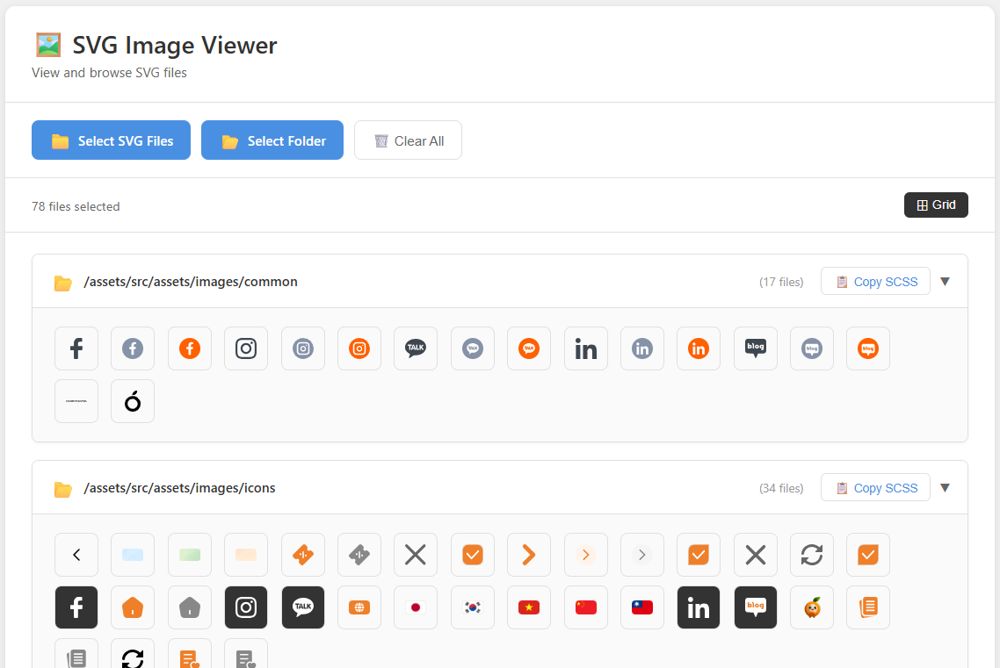

# SVG Image Viewer

A modern, web-based SVG image viewer and code generator that helps you browse SVG files, organize them by folders, and generate HTML/SCSS code snippets for easy integration into your projects.



## Features

### 🖼️ Image Management
- **Select Multiple Files**: Choose individual SVG files or entire folders
- **Folder Grouping**: Automatically organizes SVG files by their folder structure
- **Grid View**: Display icons in a clean grid layout (10 columns per row)
- **Collapsible Folders**: Expand/collapse folder groups for better organization

### 📋 Code Generation
- **HTML Code**: Generate HTML snippets with icon classes
- **SCSS Code**: Generate SCSS code with background-image URLs and dimensions
- **Copy to Clipboard**: One-click copy for both HTML and SCSS code
- **Syntax Highlighting**: Beautiful code highlighting using Prism.js

### 🎨 Modern UI
- Clean, modern dashboard-style interface
- Responsive design that works on all devices
- Dark theme code blocks for better readability
- Smooth animations and transitions

### 🔧 Technical Features
- **Automatic Size Detection**: Reads actual SVG dimensions (width/height) from the files
- **Path Management**: Automatically formats paths starting with `/assets/`
- **Bulk SCSS Export**: Copy SCSS for entire folders at once
- **Individual Code View**: Click any icon to see its HTML and SCSS code

## Getting Started

### Prerequisites
- A modern web browser (Chrome, Firefox, Edge, Safari)
- No server or build tools required - runs entirely in the browser

### Installation

1. Clone or download this repository:
```bash
git clone <repository-url>
cd view-svg
```

2. Open `index.html` in your web browser:
   - Simply double-click `index.html`, or
   - Use a local web server (optional):
     ```bash
     # Using Python
     python -m http.server 8000
     
     # Using Node.js
     npx http-server
     ```

3. That's it! The application will load in your browser.

## Usage

### Selecting Files

1. **Select Individual Files**:
   - Click "Select SVG Files" button
   - Choose one or more SVG files from your computer

2. **Select Folder**:
   - Click "Select Folder" button
   - Choose a folder containing SVG files
   - All SVG files in the folder and subfolders will be loaded

### Viewing Icons

- Icons are displayed in a grid layout (10 per row)
- Icons are grouped by their folder structure
- Click on a folder header to expand/collapse it
- Each icon shows its actual rendered size (max 100px height)

### Generating Code

#### For Individual Icons

1. Click on any SVG icon
2. A popup will appear showing:
   - **HTML Code**: `<span class="icon icon-name"></span>`
   - **SCSS Code**: CSS class definition with background-image and dimensions
3. Click "Copy HTML" or "Copy SCSS" to copy the code to clipboard

#### For Entire Folders

1. Click the "📋 Copy SCSS" button next to any folder name
2. The complete SCSS code for all icons in that folder will be copied
3. Format:
   ```scss
   .icon {
     &.icon-name-1 {
       background-image: url(/assets/folder/icon-name-1.svg);
       width: 24px;
       height: 24px;
     }
     &.icon-name-2 {
       background-image: url(/assets/folder/icon-name-2.svg);
       width: 20px;
       height: 20px;
     }
     // ... more icons
   }
   ```

### Managing Files

- **Clear All**: Click "Clear All" button to remove all loaded files
- **View Mode**: Toggle between grid view (currently only grid is available)

## Code Format

### HTML Output
```html
<span class="icon icon-name"></span>
```

### SCSS Output
```scss
.icon-name {
  background-image: url(/assets/folder/icon-name.svg);
  width: 24px;
  height: 24px;
}
```

**Note**: 
- Class names are automatically generated from filenames (kebab-case)
- File extensions are removed
- Dimensions are read from the actual SVG file attributes
- Paths are automatically prefixed with `/assets/`

## Folder Structure

When selecting a folder, the application:
- Groups files by their folder path
- Displays folder paths starting from `/assets/`
- Example: If you select `D:\project\src\assets\images\icons`, it will display as `/assets/images/icons`

## Browser Compatibility

- ✅ Chrome (recommended)
- ✅ Firefox
- ✅ Edge
- ✅ Safari
- ⚠️ Internet Explorer (not supported)

## Technologies Used

- **HTML5**: Structure and file input APIs
- **CSS3**: Modern styling with flexbox and grid
- **Vanilla JavaScript**: No frameworks, pure ES6+
- **Prism.js**: Syntax highlighting for code blocks

## File Structure

```
view-svg/
├── index.html          # Main HTML file
├── styles.css          # All styles
├── script.js           # Application logic
└── README.md          # This file
```

## Features in Detail

### Automatic Size Detection
The application reads the `width` and `height` attributes from SVG files, or extracts them from the `viewBox` attribute if width/height are not specified. This ensures accurate dimensions in the generated SCSS.

### Path Management
- Files selected individually are placed in "Standalone Files" group
- Files from folders are grouped by their relative path
- All paths are formatted to start with `/assets/` for consistency

### Code Highlighting
Uses Prism.js with the "Tomorrow" dark theme for beautiful syntax highlighting of HTML and SCSS code.

## Contributing

Contributions are welcome! Please feel free to submit a Pull Request.

## License

This project is open source and available under the MIT License.

## Support

If you encounter any issues or have questions, please open an issue on the repository.

---

**Made with ❤️ for developers who love clean, organized code**

